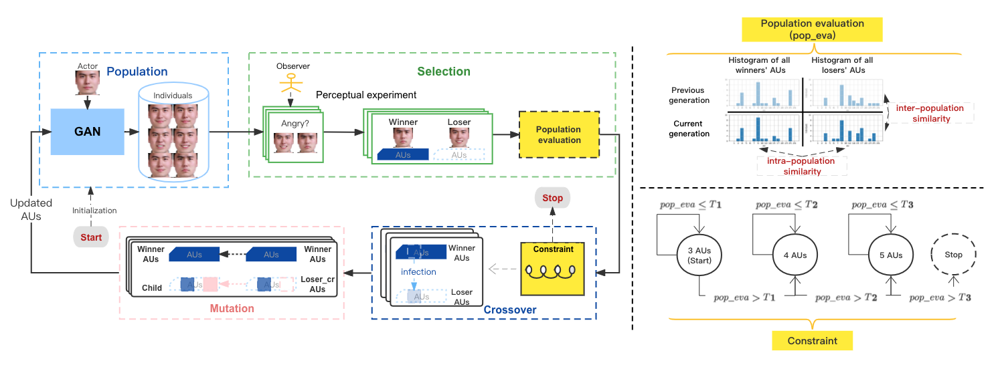

# Exploring Mental Prototypes by an Efficient Interdisciplinary Approach: Interactive Microbial Genetic Algorithm (IMGA)
This is the official implementation of [[Paper](https://hal.science/hal-04050608/document)] Exploring Mental Prototypes by an Efficient Interdisciplinary Approach: Interactive Microbial Genetic Algorithm (IMGA).

For more information, please refer to our project [IMGA](https://yansen0508.github.io/Interactive-Microbial-Genetic-Algorithm/).

## Approach


## Requirements
Please install Pytorch, Torchvision, [psychopy](https://www.psychopy.org/), and dependencies.
```shell
pip install -r requirements.txt
```

## Description
The generator is based on [GANimation](https://github.com/albertpumarola/GANimation).
The interface of the perceptual experiment is based on Psychopy.

The input image and the output images are 148 * 148.

<span style="background-color: #f1f1f1; padding: 5px;"><code>datasets/results/</code></span>:
All the generated images can be found in <span style="background-color: #f1f1f1; padding: 5px;"><code>test_ganimation_30</code></span>.

<span style="background-color: #f1f1f1; padding: 5px;"><code>datasets/test/imgs/</code></span>: image folder.

<span style="background-color: #f1f1f1; padding: 5px;"><code>datasets/test/aus_openface.pkl</code></span>: dictionary containing the action units of each image.

<span style="background-color: #f1f1f1; padding: 5px;"><code>datasets/test/train_ids.csv</code></span>: the file containing the names of the images to be used to train.

<span style="background-color: #f1f1f1; padding: 5px;"><code>datasets/test/test_ids.csv</code></span>: the file containing the names of the images to be used to test.

<span style="background-color: #f1f1f1; padding: 5px;"><code>csv/</code></span>: containing all the human feedback and the trial information.

<span style="background-color: #f1f1f1; padding: 5px;"><code>subject/</code></span>: 560 different faces are generated by activating 3 out of 16 action units. 
Example subject comes from [MMI datasets](https://mmifacedb.eu/).

<span style="background-color: #f1f1f1; padding: 5px;"><code>*.txt</code></span>: texts displayed during the perceptual experiments.

### To run: 
IMGA.py

## Citation
If you use this code or ideas from the paper for your research, please cite our paper:
```BibTeX
@inproceedings{yan2023exploring,
  title={Exploring Mental Prototypes by an Efficient Interdisciplinary Approach: Interactive Microbial Genetic Algorithm},
  author={Yan, Sen and Soladie, Catherine and Seguier, Renaud},
  booktitle={2023 IEEE 17th International Conference on Automatic Face and Gesture Recognition (FG)},
  pages={1--8},
  year={2023},
  organization={IEEE}
}
```

## Acknowledgement
This work is supported by Randstad and ANR REFLETS.
